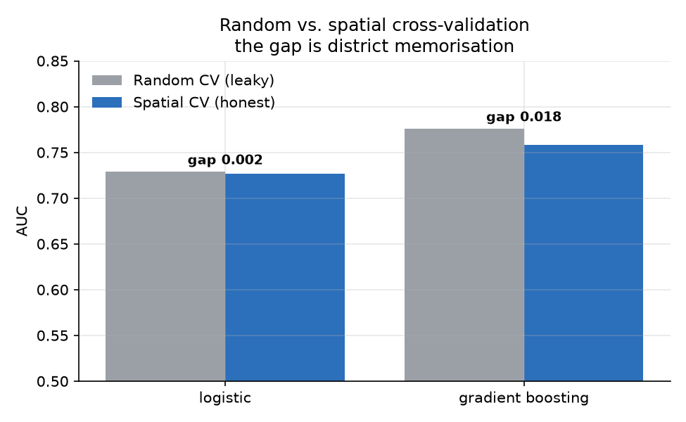

# nfhs-climate-link

A reproducible pipeline linking India's National Family Health Survey (NFHS-5, ~241k women aged 15–24) to gridded climate data, with an honestly-evaluated predictive model and a district-level need map.

**📄 [Read the full write-up (PDF)](outputs/REPORT.pdf)** · [Report source (Markdown)](REPORT.md)

---

## What this project found

**Whether a young woman in India uses hygienic menstrual materials is predicted overwhelmingly by household wealth and her own education.** Long-run climate adds a small amount; interview-windowed acute-heat exposure — the most demanding part of the pipeline to build — adds essentially nothing on top. Separately, the project demonstrates a methodological caution: on spatially clustered survey data, standard cross-validation *overstates* a flexible model's accuracy by letting it memorise district baselines, and district-grouped ("spatial") cross-validation is needed to measure real generalisation.



*Gradient boosting's honest AUC is 0.758, not the 0.776 random CV reports — the 0.018 gap is district memorisation. The linear model barely leaks.*

## Results at a glance

| | |
|---|---|
| Honest predictive performance (gradient boosting, spatial CV) | **AUC 0.758** |
| Spatial leakage (random − spatial AUC), gradient boosting | 0.018 |
| Spatial leakage, logistic regression | 0.002 |
| SES-only → +climate normals | 0.724 → 0.757 (**+0.033**) |
| +acute heat (ERA5-Land) | 0.758 (**+0.001**) |
| Hygienic-material use, poorest → richest wealth quintile | 19% → 66% |

## Recode validation

Every result rests on a recode that reproduces four independently published NFHS-5 figures, checked before any modelling:

```
[PASS] n_women_15_24            observed 241,180   expected 241,180
[PASS] any_hygienic_broad       observed  77.6%    expected  77.6%
[PASS] exclusive_hygienic_broad observed  50.0%    expected  49.8%
[PASS] sanitary_napkin_use      observed  64.1%    expected  64.4%
```

## The bug this codebase is built around

NFHS records menstrual protection as multiple-response binaries. Between survey rounds, NFHS-5 inserted *menstrual cup* at position `(e)`, shifting every later response down one letter — so a naive positional mapping sends NFHS-4 *"used nothing"* onto NFHS-5 *"used a menstrual cup"*, inverting the outcome for the most deprived respondents. It does not raise; it produces a believable but wrong result. Every mapping here resolves through a canonical label (`config.PROTECTION_ITEMS`), and `tests/test_outcomes.py::test_suffix_trap` locks the failure out of future refactors.

## Pipeline

```bash
pip install -r requirements.txt
python scripts/01_build_survey.py --recode data/raw/IAIR7EFL.DTA   # survey frame + benchmark validation
python scripts/02a_merge_covariates.py                            # DHS climate normals (no GEE)
earthengine authenticate
python scripts/02b_gee_heat.py --gps data/raw/IAGE7AFL.shp        # ERA5-Land interview-windowed heat
python scripts/03_train.py                                        # models + random-vs-spatial CV + ablation
python scripts/04_district_map.py                                 # district need map (ranked CSV)
python scripts/05_figures.py                                      # all figures
python scripts/make_pdf.py                                        # report -> PDF
```

## Layout

```
src/nfhs_climate/
  config.py            paths, variable maps, published benchmarks
  data/nfhs.py         recode loading, outcome construction
  data/validate.py     benchmark checks (fail-loud)
  data/covariates.py   DHS climate-normal merge
  data/climate_gee.py  ERA5-Land heat exposure via Earth Engine
  models/features.py   modelling matrix (district = group, not feature)
  models/evaluate.py   random vs spatial cross-validation
  models/models.py     logistic + gradient boosting
  models/needmap.py    district need map (raw + model-adjusted)
scripts/               01-05 pipeline + make_pdf
outputs/figures/       six result figures (tracked)
outputs/tables/        result tables + district_need_map.csv (tracked)
REPORT.md / .pdf       the write-up
```

## Data

NFHS microdata are **not** redistributed here (DHS terms); obtain them free on registration from [The DHS Program](https://dhsprogram.com/data/). Climate normals are from the DHS Geospatial Covariates; acute heat from [ERA5-Land](https://cds.climate.copernicus.eu/) via Google Earth Engine. All figures and result tables are generated artifacts, tracked in `outputs/`; raw and intermediate data are gitignored.

## Scope and honesty

NFHS-5 only — pooling NFHS-4 needs a 707↔640 district harmonisation no published source in this literature provides. This is **predictive modelling, not causal inference**; associations here are not effects, and the write-up does not claim otherwise. NFHS-6 fact sheets were released in May 2026 but its microdata were not yet public at the time of analysis; the pipeline is built to ingest them on release.

## Licence

Code MIT. No survey microdata included or redistributable.
