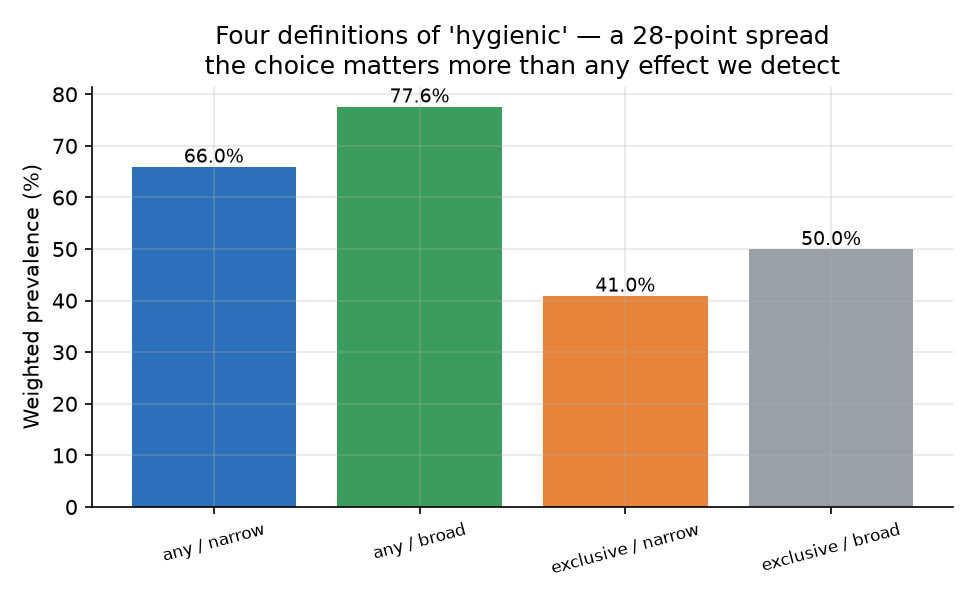
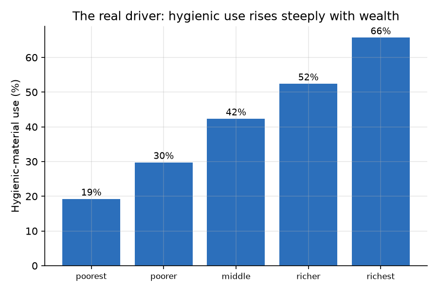
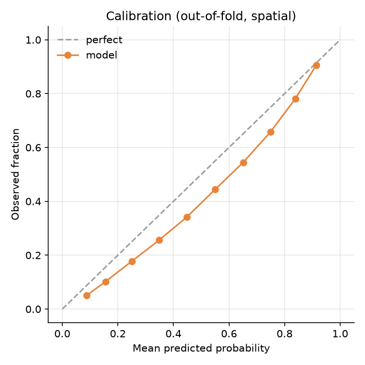
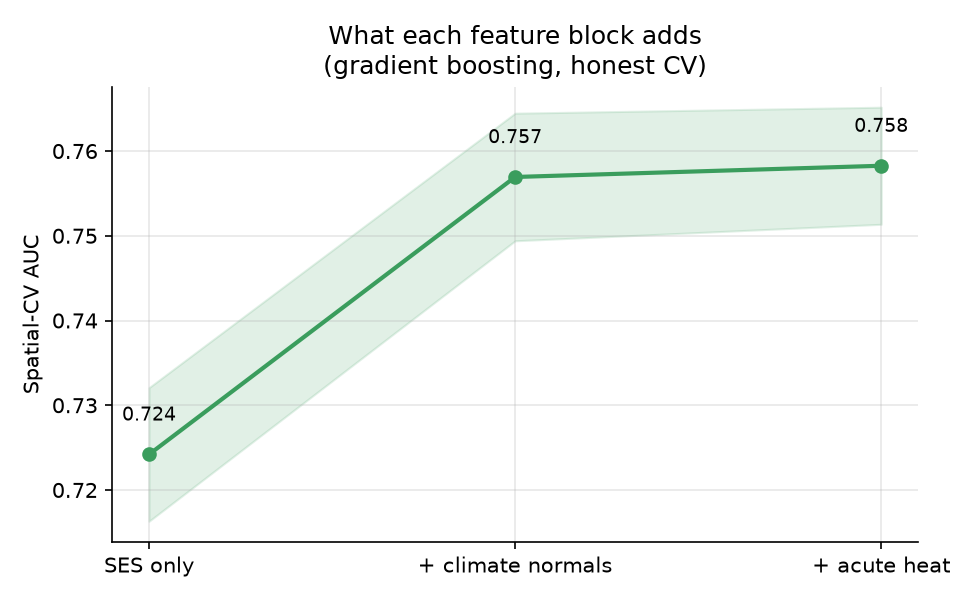
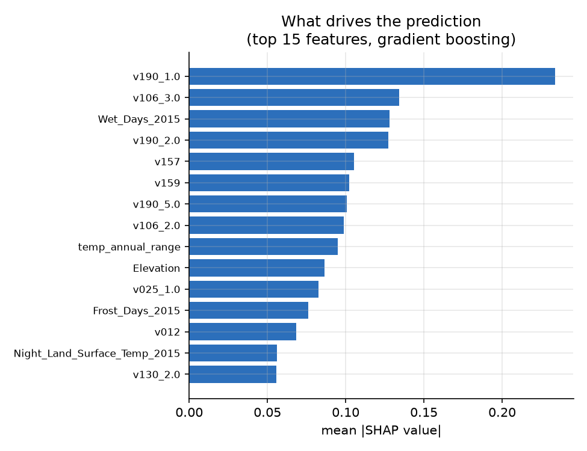

# Heat, socioeconomic status, and menstrual hygiene practice in India: an NFHS-5 predictive-modelling study

This report summarises the pipeline in this repository: linking NFHS-5 (2019–21) individual-level survey data to DHS geospatial climate covariates and Earth Engine–derived acute heat exposure, then modelling menstrual hygiene practice with an explicit random-vs-spatial cross-validation comparison.

**This is predictive modelling, not causal inference.** Nothing here estimates the *effect* of heat on hygiene practice. The question answered is narrower and more useful as an engineering artifact: how much of a model's apparent skill is genuine signal versus memorised geography, and which feature blocks carry that signal.

---

## 1. Data and pipeline

| Stage | Source | Result |
|---|---|---|
| Survey recode | NFHS-5 individual recode (`IAIR7EFL.DTA`), women 15–24 | 241,180 respondents |
| Outcome construction | Multiple-response menstrual-material items, mapped by canonical label (not letter suffix — see `README.md`) | Four outcome definitions, 41%–78% prevalence spread |
| Climate normals | DHS Geospatial Covariates (`IAGC7AFL.csv`), cluster-level, 2000–2020 snapshots | 99.1% of women matched to a covariate cluster |
| Acute heat exposure | ERA5-Land daily reanalysis via Google Earth Engine; district-relative 90th-percentile heat-index threshold; heat-day count in the 12 months before each woman's interview | 27,308 of 29,899 clusters computed (5 of 60 batches timed out and were skipped); heat exposure attached to 90.9% of women |
| Modelling frame | Survey + climate-normal + acute-heat features merged on cluster/district id | n = 240,230, 707 districts, 36 features |

---

## 2. Recode validation

Before any modelling, the pipeline reproduces four externally published NFHS-5 figures directly from the raw recode. All four pass:

| Check | Observed | Expected | Source |
|---|---|---|---|
| n, women 15–24 | 241,180 | 241,180 | Singh & Singh 2025, *Front Reprod Health* |
| Any hygienic material (broad) | 77.6% | 77.6% | Singh & Singh 2025, Table 3 |
| Exclusive hygienic material (broad) | 50.0% | 49.8% | Meher & Sahoo 2023, *BMC Women's Health* |
| Sanitary napkin use | 64.1% | 64.4% | Singh & Singh 2025, Table 3 |

A recode that cannot reproduce known published numbers is not a recode worth modelling with. This one does.

### Outcome definition is a modelling decision, not a detail

"Menstrual hygiene" has no single agreed definition. Two independent choices — whether locally prepared napkins count as hygienic, and whether *exclusive* use is required — produce four prevalence estimates spanning **41.0% to 77.6%**, a 28-point range wider than any effect this study (or comparable studies) could plausibly detect.



The modelling below uses **exclusive / narrow** (pads, tampons, or menstrual cup only — cloth and locally prepared napkins both disqualify) as the primary outcome, since it is the strictest and most defensible definition.

---

## 3. The real driver: wealth

Before climate enters the picture, hygienic-material use rises steeply and near-monotonically with household wealth quintile:



Any climate association has to be read against this gradient — wealth and climate normals are correlated across India's geography, which is exactly why the ablation in Section 5 separates them.

---

## 4. Random vs. spatial cross-validation

The central methodological claim of this repository: **random k-fold CV overstates predictive skill on spatially clustered data**, because test-set women live in the same districts as training-set women, so the model partly gets credit for memorising district-level baselines rather than learning transferable signal. District-grouped ("spatial") CV — where every test district is entirely unseen during training — removes that credit.

| Model | Random-CV AUC | Spatial-CV AUC | Leakage gap |
|---|---|---|---|
| Logistic regression | 0.729 | 0.727 | 0.002 |
| Gradient boosting | 0.776 | 0.758 | 0.018 |


The logistic model barely leaks (0.002) — as a linear model with modest capacity, it has little room to memorise district idiosyncrasies. Gradient boosting leaks nearly an order of magnitude more (0.018): its extra flexibility is partly spent fitting district-specific patterns that don't generalise to new districts. **The honest number for gradient boosting is spatial AUC 0.758, not the random-CV 0.776** a less careful evaluation would report.

### Calibration

Out-of-fold, spatial-CV predicted probabilities track observed rates reasonably closely across the probability range:



---

## 5. Feature ablation: what does climate actually add?

Holding the model (gradient boosting, spatial CV) fixed, three feature blocks are compared:

| Block | Spatial AUC | Δ vs. previous |
|---|---|---|
| SES only | 0.724 | — |
| + DHS climate normals (typical district climate) | 0.757 | **+3.3 pts** |
| + acute heat (ERA5-Land, interview-windowed heat days) | 0.758 | +0.1 pts |



This is the most notable empirical finding in the pipeline. Climate **normals** — a district's typical thermal environment, available with no Earth Engine dependency — carry almost all the climate-related predictive signal. The **acute**, interview-windowed heat-day count, despite requiring the most engineering effort in this project (dewpoint band-name fixes, batching, null-threshold handling, reducer output naming — see commit history), adds essentially nothing on top. Two readings are possible and are not distinguished by this design: acute heat genuinely carries little independent signal for this outcome, or district-normal climate is already a good enough proxy for a district's acute heat regime that the acute measure is largely redundant with it.

### What drives the prediction

SHAP importance for the gradient-boosting model, full feature set:



---

## 6. District need map

Districts ranked by weighted hygienic-material-use rate (raw need), with an adjusted-need flag: **negative adjusted gap = the district does worse than its own socioeconomic profile predicts** (out-of-fold, spatially cross-validated prediction, so this is never in-sample). Full table: `outputs/tables/district_need_map.csv` (707 districts, all with 270+ respondents — district-level aggregates only, no individual data).

**Top 15 highest-need districts:**

| rank | district | state | n women | hygienic rate | adjusted gap |
|---|---|---|---|---|---|
| 1 | South Salmara Mancachar | Assam | 382 | 6.7% | −0.164 |
| 2 | Sidhi | Madhya Pradesh | 453 | 6.9% | −0.209 |
| 3 | Karimganj | Assam | 415 | 7.6% | −0.173 |
| 4 | Purba Champaran | Bihar | 473 | 7.8% | −0.141 |
| 5 | Mahisagar | Gujarat | 294 | 8.4% | −0.217 |
| 6 | Banda | Uttar Pradesh | 435 | 8.4% | −0.163 |
| 7 | Dohad | Gujarat | 443 | 9.1% | −0.183 |
| 8 | Cachar | Assam | 379 | 9.8% | −0.204 |
| 9 | Gopalganj | Bihar | 494 | 10.3% | −0.157 |
| 10 | East Jaintia Hills | Meghalaya | 500 | 10.4% | −0.297 |
| 11 | Hardoi | Uttar Pradesh | 511 | 10.6% | −0.099 |
| 12 | Siwan | Bihar | 528 | 10.6% | −0.136 |
| 13 | Chirang | Assam | 370 | 10.6% | −0.177 |
| 14 | West Jaintia Hills | Meghalaya | 420 | 10.9% | −0.250 |
| 15 | Mon | Nagaland | 273 | 11.0% | −0.346 |

Every one of the top-15 districts is flagged underperforming. Assam accounts for 4 of the 15; the two Jaintia Hills districts (Meghalaya) and Mon (Nagaland) show the largest adjusted-need gaps, meaning something beyond their SES profile — not captured by wealth, education, or water/sanitation access alone — is holding them back further than poverty would predict on its own.

---

## 7. Limitations

1. **Predictive, not causal.** No claim is made that heat, wealth, or any other feature *causes* hygiene practice. AUC and SHAP importance describe association and predictive contribution, not effect size.
2. **Cross-sectional design.** NFHS-5 is a single interview wave; temporality between any exposure and the outcome cannot be established.
3. **Ecological climate features.** DHS geospatial covariates and the acute heat-day count are cluster/location-level, not measures of an individual woman's personal exposure (occupational, indoor, commuting exposure are unmeasured).
4. **Outcome definition sensitivity.** The primary outcome (exclusive/narrow) is one of four defensible definitions spanning a 28-point prevalence range (Section 2); results should be read as conditional on this choice.
5. **Acute heat coverage gap.** 5 of 60 Earth Engine batches (≈2,591 of 29,899 clusters) timed out and were skipped rather than retried, giving 90.9% rather than 100% heat-exposure coverage. This is a missing-data mechanism (server timeout) uncorrelated with any covariate of interest, so it should not bias the ablation result, but it is not re-verified here.
6. **Self-reported outcome.** Menstrual material use is self-reported in interview, with the usual caveats about social-desirability and recall.

---

## 8. Reproducing this report

```bash
pip install -r requirements.txt
python scripts/01_build_survey.py --recode data/raw/IAIR7EFL.DTA
python scripts/02a_merge_covariates.py
earthengine authenticate
python scripts/02b_gee_heat.py --gps data/raw/IAGE7AFL.shp
python scripts/03_train.py
python scripts/04_district_map.py
python scripts/05_figures.py
```

NFHS-5 microdata is not redistributed in this repository (DHS terms); obtain it from [The DHS Program](https://dhsprogram.com/data/). All figures and result tables in `outputs/` are generated artifacts and are tracked in this repo; raw and intermediate data are not.
